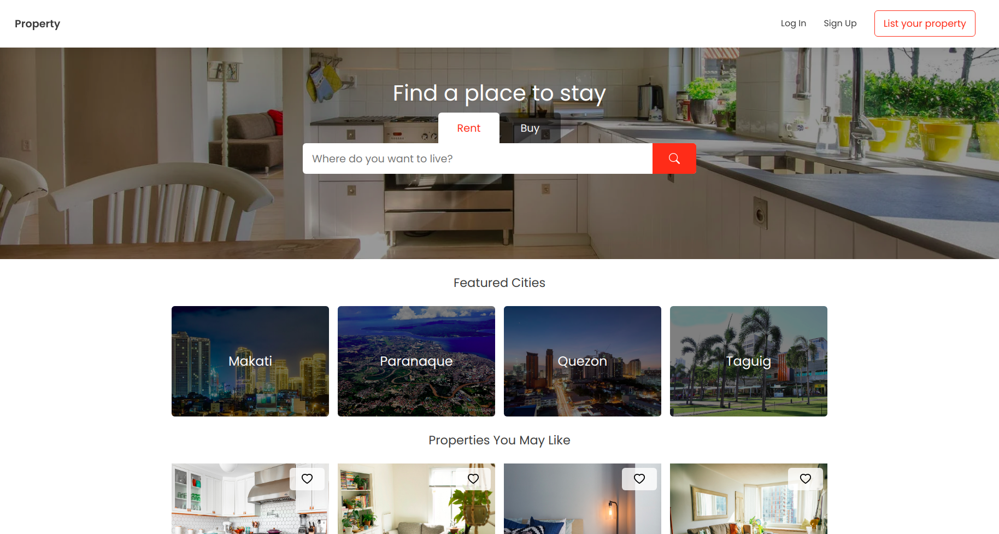

## Property Listings

- a full stack real state project built with React, Typescript, Node, Graphql and MongoDb.

### Screenshots



### Breakdown

- Front End
  - Only used functional components using React Hooks
  - Mobile first approach
  - Used css-in-js (Styled Components) approach to eliminate css class name collision
  - Used React Context Api for global state management
  - Used Apollo GraphQL client for data fetching
  - Used typescript to catch bugs during development time
  - Use absolute import for file
  - Linted using Eslint
  - Formatted using Prettier
- Back End
  - Used Apollo Graphql Server for creating graphql server
  - Used typescript in writing api's
  - Used MongoDB for database but will try to move over PostgreSQL

### Features

- Login with email
- Login with google
- Create an account
- View property details
- Search properties
- Inquire for property
- Toggle Favorites property
- Create a property

### Stacks

- React
- Styled Components
- Typescript
- Node
- Graphql
- MongoDB

### Installation

Clone Repository

```
git clone https://github.com/jrussumbrella/property-listings
```

Client

```
cd property-listing
npm install
```

```
cd property-listing
npm install
```

### Run Client

```
cd client
npm start
```

### Run Server

```
cd server
npm start
```

### Lint

```
npm run lint
```

### Format

```
npm run format
```
